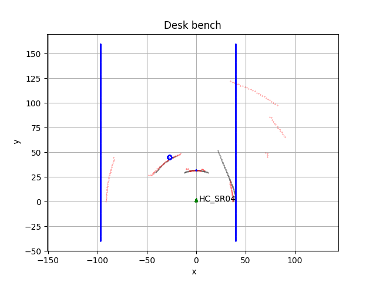

########
Flatland
########

Flatland is a library that allows you to create a virtual 2-D environment in
which you can put and move one or more virtual sensors to get virtual range
measures.

Moving the sensors into this virtual space (really a plan) you can test your
`SLAM <https://en.wikipedia.org/wiki/Simultaneous_localization_and_mapping>`_
or navigation algorithms.

The name Flatland is after the romance
`"Flatland: A Romance of Many Dimensions" <https://en.wikipedia.org/wiki/Flatland>`_
by  Edwin Abbott Abbott.

This romance describes a flat world populated by geometric figures that live
and act as persons.

#########
Rationale
#########

If you want (like me) make some experience developing a SLAM algorithm, you
have two choices:

* set up a laboratory equipped with objects and buy a robot;
* use a virtual environment end simulate a robot moving around.

Since I don't have a laboratory nor a room to devote to this purpose, the only
thing I can do is simulate the overall stuff.

This simple library allows this.

I know that exists simulators more and more advanced than this one, allowing a
real 3-D space simulation with real robots and real sensor emulation, but all
these are too complex and, at the end, far from my needs.

So I developed this simple one: it was amusing and only based on geometrical
principles.

I hope it will be useful also for other than me.

########
Overview
########

In order to use the virtual environment first you have to add to it simple or
more complex geometric figures representing objects and second, add one or
more sensors that can *sense* the objects around them.

******************
The *flat* objects
******************

Flatland has been mainly thought to simulate an indoor environment,so a really
flat space, in which a *robot* carrying one or more sensors can move around. 

From this *flat* point of view therefore, all object will be represented by
their footprint: a simple box will be a rectangular shape, a four legged chair
will be represented by four circles positioned on a square perimeter, etc.

So the basic classes that can be used to buildup objects are the *Shape* class
and the *CompoundShape* class.

The Shape class is the base class to build all simple shapes that in case can
be grouped together to compose a compound object.

Once created, a compound object can be managed as any other object in the 
flat environment.

Shapes and CompundShapes are created as collection of points, defining its
contour, that can be traslated, rotated and so moved around in the 2-D
environment as a whole.

In fact all objects (shapes and compound shapes) share the same methods except
the constructor because each shape will need its own procedure to define
points of its contour.

***********
The sensors
***********

The only sensor simulated by this library is a generic
*time of flight range sensor* (ToF sensor).

This kind of sensor operates returning the distance of the nearest object in
front of it using the echo of a signal issued by the sensor itself.

For the nearest object, the time of flight of the signal emitted will be the
lowest and so that will be the measure issued.

The basic parameters for this kind of sensors are:

* the width of the beam of the signal emitted;
* the maximum distance that can be detected.

The signal emitted can be ultrasonic, infrared, laser (and perhaps other that
I don't know).

The cost of these sensor depends on the quality of the reading which is closely
linked to the parameters indicated above: beam width and maximum range.

As general rule, the narrow the beam is and the bigger the range is the better
the sensor is and therefore the bigger its cost.

Some sensor examples
--------------------

The HC-SR04 ultrasonic sensor
^^^^^^^^^^^^^^^^^^^^^^^^^^^^^

It is a really low cost device for Arduino projects and its performances are
really poor:

* bream width: 35 -- 40 degrees
* range:  60 cm

The IR Lidar Range Finder
^^^^^^^^^^^^^^^^^^^^^^^^^

.. image:: lidar_range_finder.jpg
   :scale: 30 %

It is a ToF sensor using Infra Red light

* beam width: 2.3 degrees
* range: 5 m 

**************************
The *Flatland* environment
**************************

As stated in the overview, a *Flatland* is an object containig *Shapes* and
*CompoundShapes* and one or more *Sensor* that can interact with them.

When created, a *Flatland* object define its reference system as the global
one common for all *flat* object composing the environment.

This imples that every movement or position are referred to the environment
coordinate system and each measurement performed by a *Sensor* must be
converted into the *global* coordinate system if you want to display it or
use fom mapping purposes fo example.

.. note::

   The unit of measurement used is the same for all *flat* objects and
   measurements.
   
   As you can see, in the examples the unit of measurement is fixed to 1 cm.
   
   It is up to you choosing the right unit for your simulations.

************************
How to make a simulation
************************

This section shows the steps to set up a *Flatland* environment from scratch
and perform a simulation.

#. **Create your own Shapes**
   
   In the virtualized environment *Flatland* each object is represented by
   its footprint.
   So, in order to populate the environment with objects one can:
   
   * use simple geometric shapes already available in the *shapes* module;

   * use the *Shape* class as base class to create new and more complex shapes;

   * use both predefined and custom shapes to compose a *CompoundShape* to
     obtain complex objects.
     Once composed, each compound will be managed as a simple shape.

#. **Ceate a Flatland virtual environment**
   
   A *Flatland* instance represents the virtual environemnt that you will
   use for your simulation.

   Add to the *flatland* object all *shapes* and/or *compunds* you created
   at the previous step.

   After that the *external* (that is the global coordinate system) has been
   set up and you can position your sensor(s) into it.

   

#. **Create one or more sensors**
   
   Each sensor instance can be customized changing its shape and/or color.

   Once created you must position and orient it in the virtual environment.
   You can do that *moving* the sensor.

   When positioning the sensor two parameters are important
   
   * the sensor position in the *flatland* environment;

   * its angular orientation by respect to the X (orizontal) axis.

#. **Add your sensors to the *Flatland* environment**

   
#. **Read your sensors**
   
   Once sensors are positioned into the *flatland* environment you can read
   your sensor obtaining single or scan range readings.

   In order to simplify the processing of the readings, the sensor returns the
   readings non only related to the local coordinate system but also in the
   global one (that is the one of the *Flatland* virtualenvironment)

#. **Compare readings with real-world measurements**
   
   In case it was available a set of readings coming from real sensor with
   same position and orientation, it is possible to show them into the same
   display.
   This allows comparison between real an simulated measurement when the
   virtual environment is a virtual representation of a real one.
   

########
Examples
########

The 'examples' folder of the project contains two scripts that implement the
steps above for two different environment:

* a desk bench simulation;

* an indoor environment.
  

**********
Desk bench
**********

This script uses the Flatland package to reproduce in a virtual *flat*
environment an empty bench desk where the sensor represents the origin of the
reference system and in front of it are placed a glass and a pen.

At the left and right side of the desk there are the walls of the room.

The unit of measurement is 1 cm

The sensor shape is an arrow and the central point of the arrow base
corresponds to the actual sensor position.

Each reading will be related to this point.

Since this scripts repesents a real test bench, for this sensor and objects
configuration real measurements are available and can be plotted along with
the virtual ones.

The script
::
   desk_bench.py

will produce a plot of the virtual environment with all *flat* objects in it,
the sensor and the visualisation of virtual (black) and read (red) readings.

Moreover is possible to see that real measurements are affected by noise
and due to echo bouncing between the walls, the real sensor 
provides measurements even over 60 cm, even if clearly false measurements.
   
Zooming into the image it is possible to see the good accordance between
real and simulated measurements.

**************************
Indoor virtual environment
**************************

The script
::
   hc_sr04_sim.py

simulates an indoor environment: a room with a chair with round legs.

Even if a quite simple environment, it shows how to use the 'SeqPolygon'
class to define the contour of a room.

Infact this class has been designed to simplify the composition of objects
with countour made only by vertical or orizontal segments.

Moreover this scrit shows the usage of some debugging functions as the one
to plot the range of vision of the sensor and the one to plot a single
reading measure.

In the following the overall plot and a zoom on the sensor zone.

